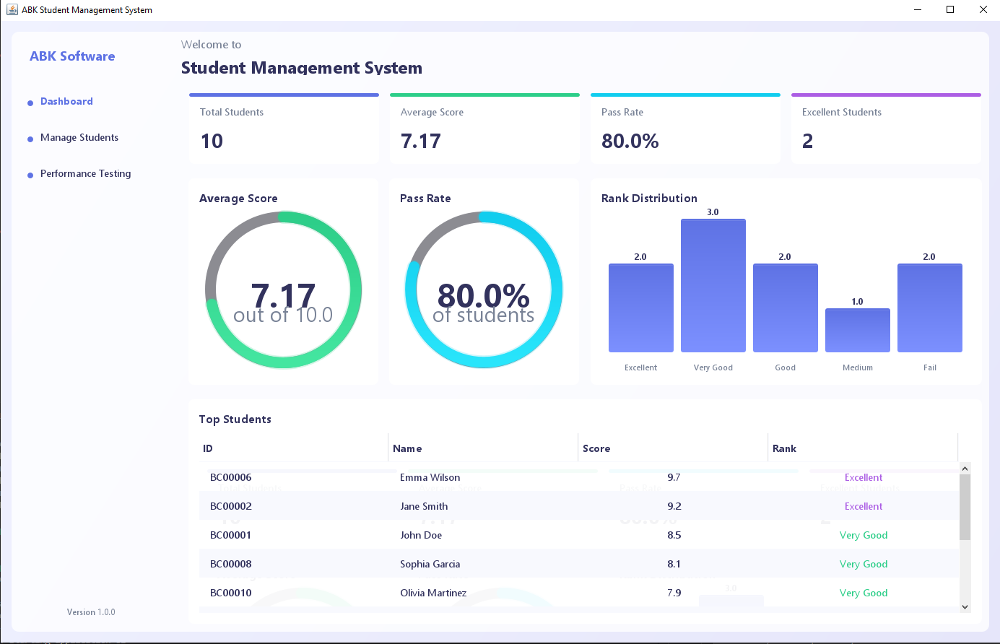
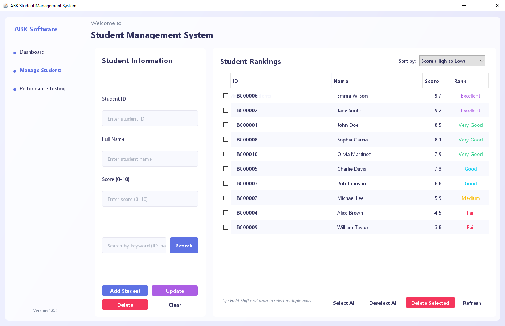
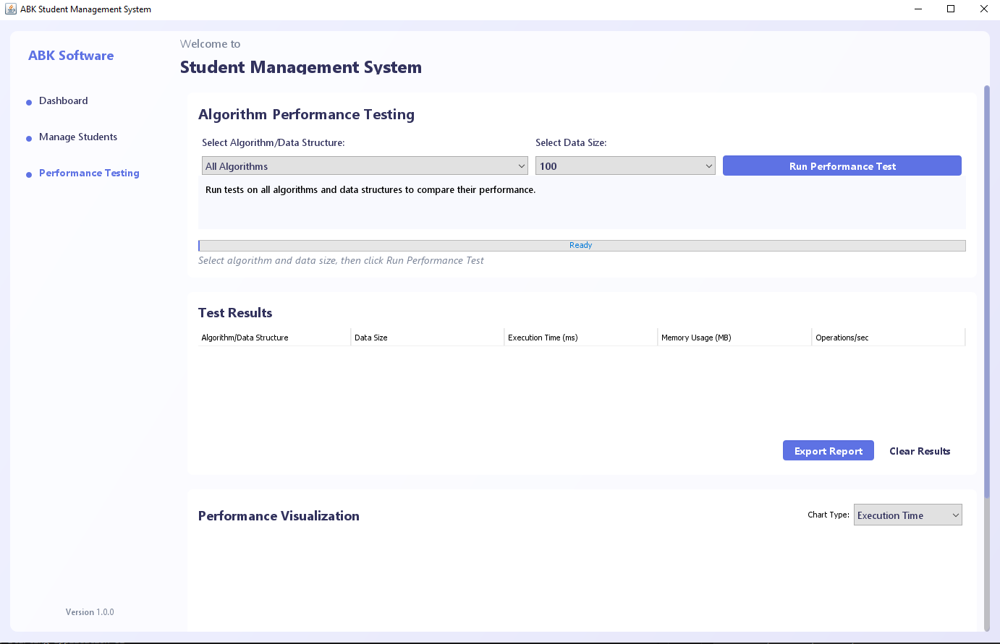

# Student Management System - ABK Software

A modern Java Swing-based student management system that integrates various data structures for optimal performance.

## Features

- Complete student information management (CRUD operations)
- Advanced search with multiple criteria
- Student sorting and filtering
- Visual statistics and charts
- Modern Java Swing UI
- Performance comparison of different ADTs
- Priority Queue implementation for student ranking

## System Requirements

- Java Development Kit (JDK) 8 or higher
- Minimum screen resolution: 1280x720

## Project Structure

```
student-management/
│
├── src/                    # Source code
│   ├── main/              # Main class
│   ├── dao/               # Data Access Objects
│   ├── model/             # Model classes
│   ├── util/              # Utilities and data structures
│   └── view/              # User interface
│
├── bin/                    # Compiled files (.class)
│
├── lib/                    # External libraries
│
└── resources/             # Resources (images, icons)
    ├── images/
    └── icons/
```

## User Interface

## Interface Screenshots

### Dashboard Panel


### Student Form Panel


### Performance Test Panel


## Installation Guide

1. Clone the repository
2. Set up the directory structure as shown above
3. Place UI resources in their respective folders:
   - Java files → src/
   - Images → resources/images/
   - Icons → resources/icons/

4. Compile and run:
```bash
javac -d bin -sourcepath src src/Main.java
java -cp bin Main
```

## Performance Optimization

The project utilizes multiple data structures for optimal performance:
- Priority Queue (MaxHeap): Student ranking management
- HashMap: Fast ID-based lookups
- ArrayList: List storage and display
- Set: Search index management

## Key Components

- DashboardPanel: Main statistics screen
- StudentFormPanel: Student data management form
- PerformanceTestPanel: ADT performance comparison
- Custom UI Components: Modern look and feel elements

## Contributing

Please create an issue or pull request if you'd like to contribute to the project.

## License

Copyright © 2025 ABK Software. All rights reserved.
